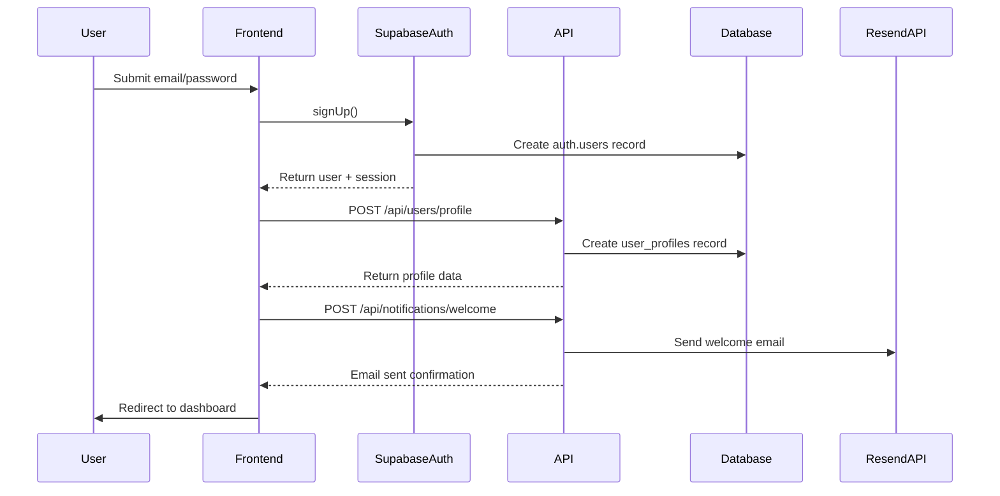
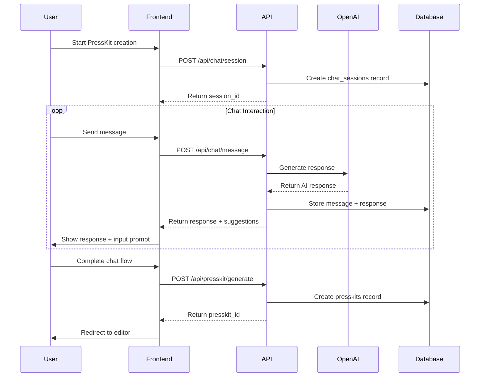
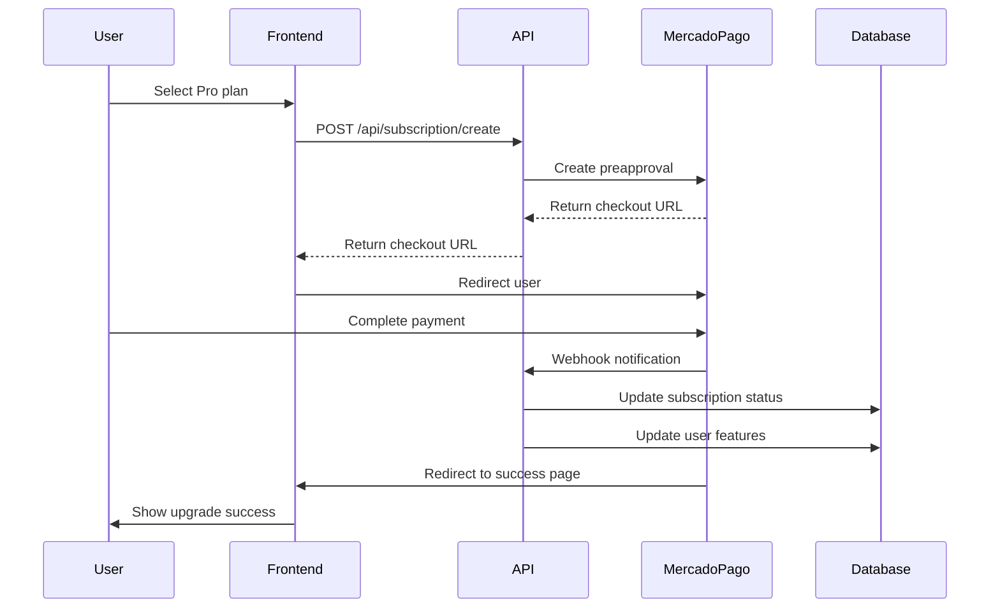
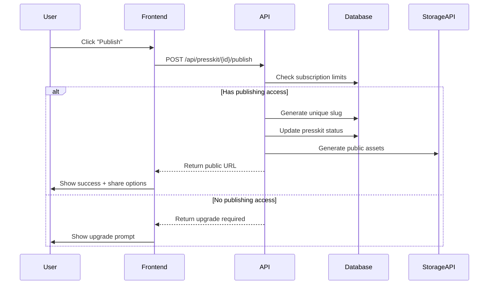
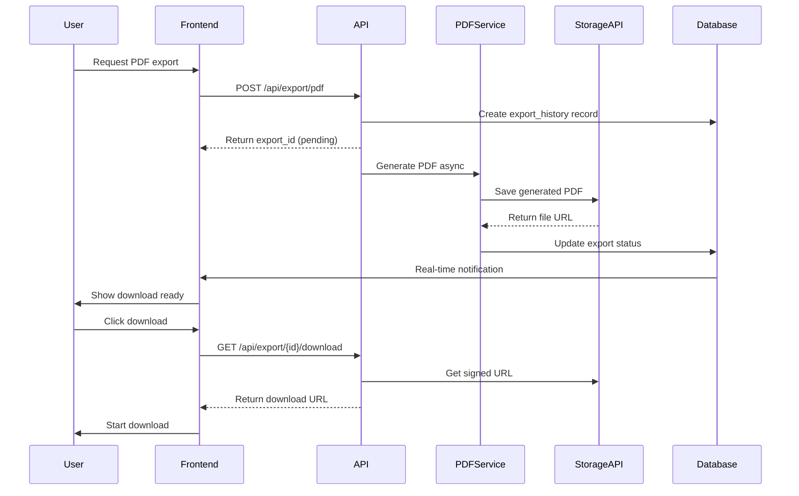

# 7. CORE WORKFLOWS

### Workflow 1: User Registration & Onboarding

### Workflow 2: Conversational PressKit Creation

### Workflow 3: Subscription Upgrade

### Workflow 4: PressKit Publishing

### Workflow 5: PDF Export Generation

---

